# GitHub Contribution Calendar

A beautiful and customizable GitHub contribution calendar component built with React, TypeScript, and Tailwind CSS. This component allows you to display GitHub contribution data in a visually appealing calendar format with various themes and customization options.

# Classic Theme


# Nature Theme

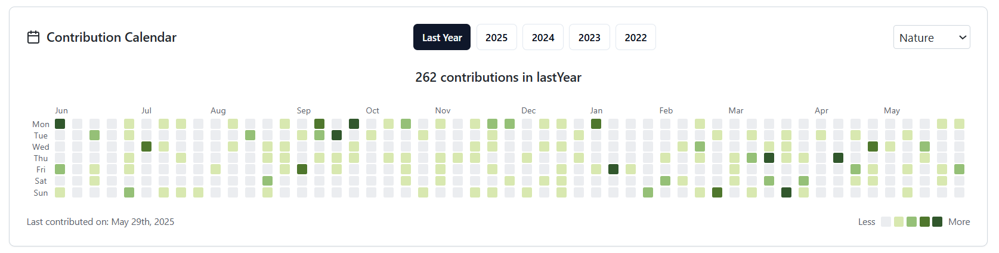

# Winter Theme

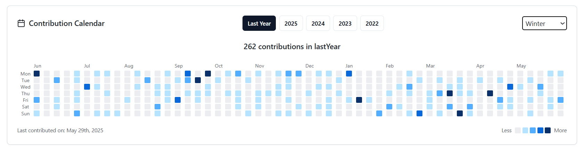

# Halloween Theme

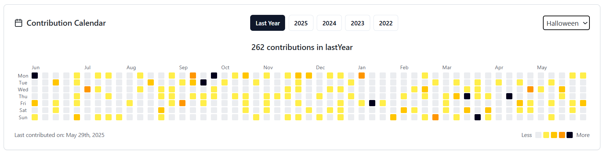

# Monotune Theme

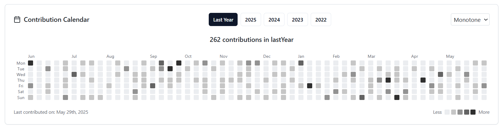

# Pastel Theme

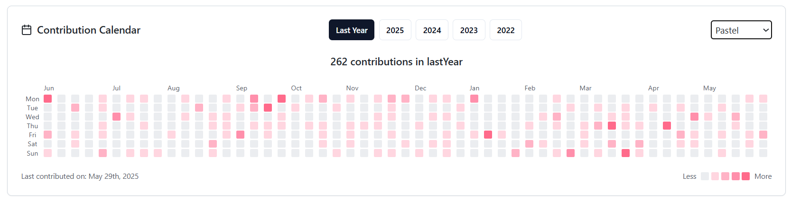

# Galaxy Theme

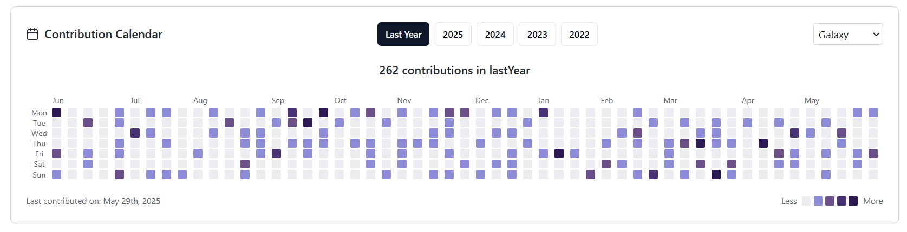

# Prism Theme

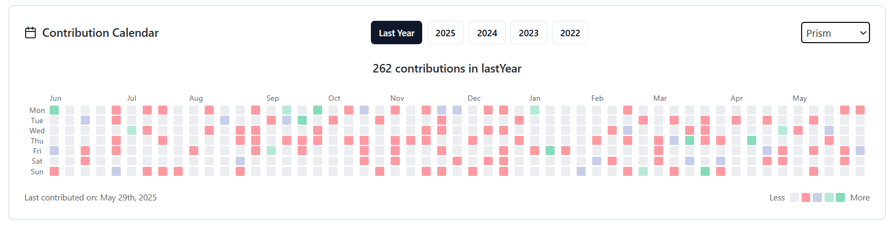

# Solar Theme

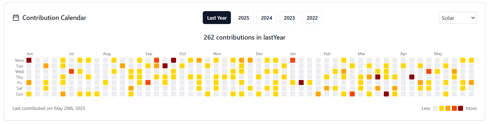

# Velvet Theme

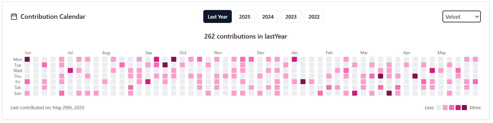

# Aurora Theme

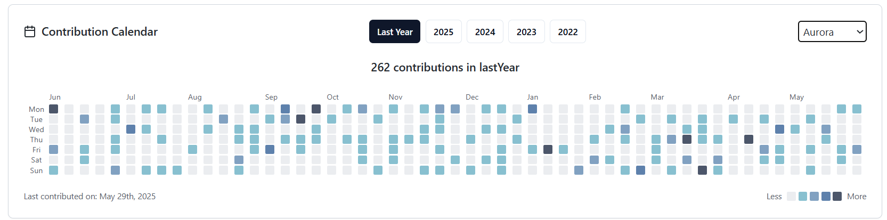

## Dark Mode

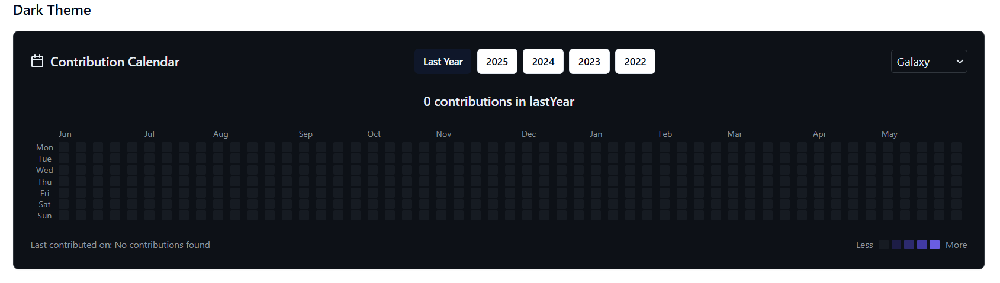

## Features

- 🎨 Multiple beautiful themes (Classic, Dark, Nature, Winter, Halloween, and more)
- 🌓 Light/Dark mode support
- 📱 Responsive design
- 🔍 Detailed contribution information on hover/click
- 🎯 Customizable appearance (block size, colors, spacing)
- 🔄 Year selection
- 📊 Contribution level highlighting
- 🔑 GitHub token support for private repositories
- ⚡ Optimized performance with throttling and debouncing
- 🎯 TypeScript support
- 🎨 Tailwind CSS styling

## Prerequisites

Before using this component, you need to:

1. Create a GitHub Personal Access Token:

   - Go to GitHub Settings > Developer Settings > Personal Access Tokens > Tokens (classic)
   - Click "Generate new token"
   - Select the following scopes:
     - `repo` (Full control of private repositories)
     - `read:user` (Read user profile data)
   - Copy the generated token immediately (you won't be able to see it again)

2. Keep your token secure:
   - Never commit your token to version control
   - Use environment variables to store your token
   - Consider using a token with limited permissions

## Installation

```bash
# Using npm
npm install react-gh-contribution-calendar

# Using yarn
yarn add react-gh-contribution-calendar

# Using pnpm
pnpm add react-gh-contribution-calendar
```

## Basic Usage

```tsx
import { GitHubCalendar } from "react-gh-contribution-calendar";

function App() {
  return (
    <GitHubCalendar
      username="your-github-username"
      token="your-github-token" // Required for accessing contribution data
    />
  );
}
```

### Using Environment Variables

```tsx
import { GitHubCalendar } from "react-gh-contribution-calendar";

function App() {
  return (
    <GitHubCalendar
      username="your-github-username"
      token={process.env.GITHUB_TOKEN} // Store token in environment variables
    />
  );
}
```

## Advanced Usage

### Custom Theme

```tsx
<GitHubCalendar
  username="your-github-username"
  token="your-github-token"
  theme="dark" // or any other theme name
  colorScheme="dark" // 'light' or 'dark'
/>
```

### Creating Custom Themes

You can create your own custom themes by providing a theme object with the following structure:

```tsx
const myCustomTheme = {
  background: "#ffffff", // Calendar background color
  text: "#24292e", // Text color
  grade4: "#216e39", // Highest contribution level
  grade3: "#30a14e", // High contribution level
  grade2: "#40c463", // Medium contribution level
  grade1: "#9be9a8", // Low contribution level
  grade0: "#ebedf0", // No contributions
  border: "#e1e4e8", // Border color
  dayBackground: "#f6f8fa", // Day cell background
  muted: "#6e7781", // Muted text color
};

// Using custom theme
<GitHubCalendar
  username="your-github-username"
  token="your-github-token"
  customTheme={myCustomTheme}
/>;
```

#### Multiple Custom Themes

You can also provide multiple custom themes:

```tsx
const myThemes = {
  ocean: {
    background: "#f0f8ff",
    text: "#1a365d",
    grade4: "#003f5c",
    grade3: "#2f4b7c",
    grade2: "#665191",
    grade1: "#a05195",
    grade0: "#d45087",
    border: "#e2e8f0",
    dayBackground: "#f7fafc",
    muted: "#4a5568",
  },
  sunset: {
    background: "#fff5f5",
    text: "#2d3748",
    grade4: "#c53030",
    grade3: "#e53e3e",
    grade2: "#f56565",
    grade1: "#fc8181",
    grade0: "#fed7d7",
    border: "#e2e8f0",
    dayBackground: "#fffaf0",
    muted: "#718096",
  },
};

// Using custom themes
<GitHubCalendar
  username="your-github-username"
  token="your-github-token"
  themes={myThemes}
  theme="ocean" // or "sunset"
/>;
```

#### Dark Mode Support

For dark mode support, you can provide different colors for light and dark schemes:

```tsx
const myTheme = {
  light: {
    background: "#ffffff",
    text: "#24292e",
    grade4: "#216e39",
    grade3: "#30a14e",
    grade2: "#40c463",
    grade1: "#9be9a8",
    grade0: "#ebedf0",
    border: "#e1e4e8",
    dayBackground: "#f6f8fa",
    muted: "#6e7781",
  },
  dark: {
    background: "#0d1117",
    text: "#c9d1d9",
    grade4: "#39d353",
    grade3: "#26a641",
    grade2: "#2ea043",
    grade1: "#238636",
    grade0: "#161b22",
    border: "#30363d",
    dayBackground: "#161b22",
    muted: "#8b949e",
  },
};

// Using theme with dark mode support
<GitHubCalendar
  username="your-github-username"
  token="your-github-token"
  customTheme={myTheme}
  colorScheme="dark" // or "light"
/>;
```

### Custom Appearance

```tsx
<GitHubCalendar
  username="your-github-username"
  token="your-github-token"
  blockSize={12}
  blockMargin={2}
  blockRadius={2}
  fontSize={14}
/>
```

### Year Selection

```tsx
<GitHubCalendar
  username="your-github-username"
  token="your-github-token"
  years={[2024, 2023, 2022]} // Custom years to display
  year={2024} // Default selected year
  onYearChange={(year) => console.log("Selected year:", year)}
/>
```

### Custom Event Handlers

```tsx
<GitHubCalendar
  username="your-github-username"
  token="your-github-token"
  onDayClick={({ date, count }) => {
    console.log(`Clicked on ${date} with ${count} contributions`);
  }}
/>
```

### Custom Rendering

```tsx
<GitHubCalendar
  username="your-github-username"
  token="your-github-token"
  renderDay={({ date, count }, defaultCell) => {
    // Custom day cell rendering
    return <div>{defaultCell}</div>;
  }}
  renderDetails={(details, date) => {
    // Custom details rendering
    return <div>{/* Your custom details component */}</div>;
  }}
/>
```

## Props

| Prop              | Type               | Default                      | Description                             |
| ----------------- | ------------------ | ---------------------------- | --------------------------------------- |
| username          | string             | required                     | GitHub username                         |
| token             | string             | required                     | GitHub personal access token            |
| data              | ContributionData[] | -                            | Pre-fetched contribution data           |
| transformData     | function           | -                            | Function to transform contribution data |
| fetchData         | function           | -                            | Custom data fetching function           |
| blockMargin       | number             | 2                            | Margin between blocks                   |
| blockRadius       | number             | 2                            | Border radius of blocks                 |
| blockSize         | number             | 12                           | Size of contribution blocks             |
| fontSize          | number             | 14                           | Base font size                          |
| theme             | string             | 'classic'                    | Theme name                              |
| customTheme       | object             | -                            | Custom theme colors                     |
| themes            | object             | -                            | Custom themes object                    |
| colorScheme       | 'light' \| 'dark'  | 'light'                      | Color scheme                            |
| hideColorLegend   | boolean            | false                        | Hide color legend                       |
| hideMonthLabels   | boolean            | false                        | Hide month labels                       |
| hideWeekdayLabels | boolean            | false                        | Hide weekday labels                     |
| hideTotalCount    | boolean            | false                        | Hide total contribution count           |
| loading           | boolean            | -                            | Loading state                           |
| renderLoading     | function           | -                            | Custom loading renderer                 |
| onDayClick        | function           | -                            | Day click handler                       |
| renderDay         | function           | -                            | Custom day cell renderer                |
| renderDetails     | function           | -                            | Custom details renderer                 |
| years             | number[]           | [current year, last 3 years] | Years to display                        |
| year              | number             | -                            | Default selected year                   |
| onYearChange      | function           | -                            | Year change handler                     |

## Security Best Practices

1. **Token Security**:

   - Never expose your token in client-side code
   - Use environment variables or secure backend storage
   - Regularly rotate your tokens
   - Use tokens with minimal required permissions

2. **Environment Setup**:

   ```env
   # .env.local
   GITHUB_TOKEN=your_token_here
   ```

3. **Production Deployment**:
   - Set up environment variables in your hosting platform
   - Use secure methods to inject tokens in production
   - Consider using a backend proxy for API calls
